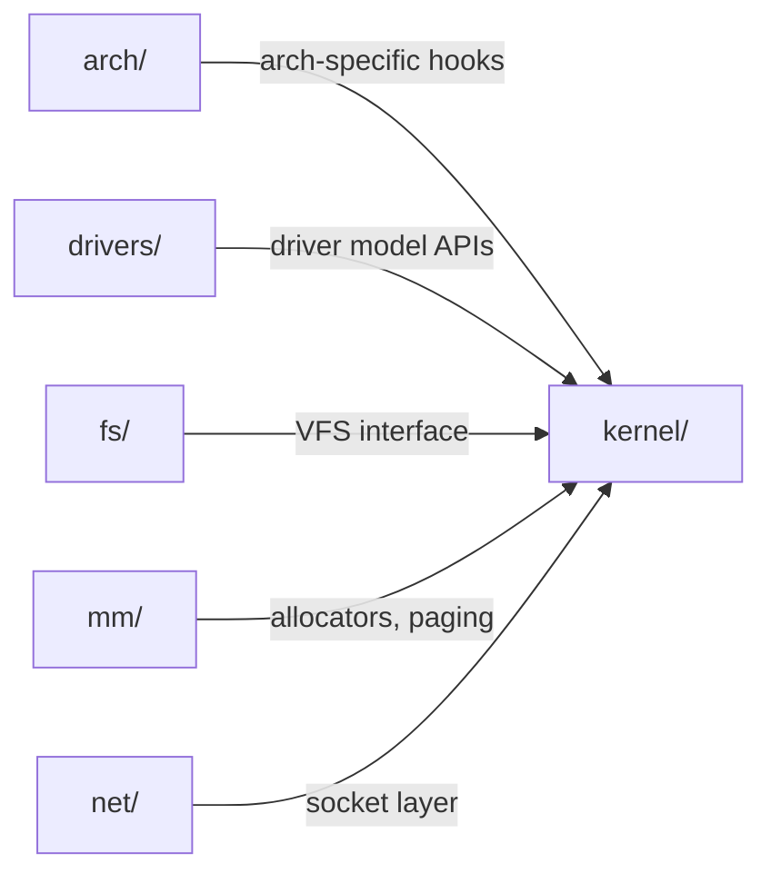

# :material-sitemap: Kernel Architecture

> The kernel source tree looks intimidating, but a handful of top-level directories account for almost everything you'll touch.

The kernel source tree is large, but it follows consistent conventions once you know what to look for. This page is a map, not an exhaustive reference.

## :material-folder-outline: Top-level layout

!!! info "Directory map"
    - `arch/` — architecture-specific code (x86, arm64, riscv, ...)
    - `drivers/` — device drivers, organized by subsystem (net, gpu, usb, ...)
    - `fs/` — filesystem implementations and the VFS layer
    - `kernel/` — core scheduler, timers, cgroups, process management
    - `mm/` — memory management: paging, allocators, reclaim
    - `net/` — the networking stack
    - `include/` — public and internal headers
    - `Documentation/` — the authoritative reference for subsystem internals

## :material-cogs: Core subsystems

!!! info "Process management and scheduling"
    Track runnable tasks and decide what runs on each CPU. The default scheduler (CFS, replaced by EEVDF in modern kernels) balances fairness and throughput.

!!! info "Memory management"
    Provides virtual memory to every process, backed by page tables, the buddy allocator for physical pages, and slab/slub allocators for kernel objects.

!!! info "The VFS (Virtual Filesystem Switch)"
    Provides a uniform interface over concrete filesystems (ext4, btrfs, xfs, network filesystems) so user space can use one set of syscalls regardless of the underlying storage.

!!! success "Device drivers"
    Interact with the rest of the kernel through well-defined frameworks (the driver model, character/block device interfaces, subsystem-specific APIs) rather than talking to hardware directly from arbitrary code.

## :material-vector-polyline: How subsystems communicate

Subsystems avoid calling into each other directly wherever possible. Instead they expose notifier chains, callback structures, and well-scoped APIs. This keeps coupling low enough that architectures and drivers can be added without touching core code.

## :material-alert: Pitfalls

!!! warning "Assuming direct cross-calls"
    New contributors often look for a direct function call from one subsystem into another. Look for a notifier chain or registered callback structure instead — direct calls are the exception, not the rule.

!!! warning "Confusing VFS with a filesystem"
    The VFS is not a filesystem itself — it's the dispatch layer. The actual on-disk logic lives in `fs/ext4`, `fs/btrfs`, etc.

## :material-help-circle: Self-Test

=== "Question 1"
    Where would you look for the code that decides which process runs next on a CPU?

=== "Answer 1"
    `kernel/`, specifically the scheduler code (CFS/EEVDF), since process management and scheduling live there.

=== "Question 2"
    A new filesystem is added to the kernel. Which top-level directory does it live in, and what layer lets user space use it without special-casing?

=== "Answer 2"
    It lives under `fs/`, and the VFS (Virtual Filesystem Switch) is the layer that exposes it through the same syscalls used by every other filesystem.

## :material-check-circle: Summary

- Most kernel work touches `arch/`, `drivers/`, `fs/`, `kernel/`, `mm/`, or `net/`.
- The VFS gives user space one syscall interface over many concrete filesystems.
- The scheduler (CFS/EEVDF) and memory management (paging, buddy allocator, slab/slub) live at the core of `kernel/` and `mm/`.
- Subsystems talk to each other through notifier chains and defined APIs, not direct calls.

Understanding this map is enough to start reading code productively. The next page covers how to turn this source tree into a bootable kernel image.
