# Memory Map

A visual map of how the core concepts in this site connect. Use it to refresh your mental model before diving into a specific page, or to review after finishing the site.

```mermaid
graph TD
Kernel((Linux Kernel)) --> Start[Getting Started]
Kernel --> Arch[Architecture]
Kernel --> Build[Build System]
Kernel --> Contrib[Upstream Contribution]
Kernel --> Debug[Debugging]

Start --> Start1[clone a stable branch]
Start --> Start2[defconfig and olddefconfig]
Start --> Start3[ctags, cscope, clangd]

Arch --> Arch1[arch slash - CPU specific code]
Arch --> Arch2[drivers slash - device drivers]
Arch --> Arch3[fs slash - filesystems and VFS]
Arch --> Arch4[mm slash - memory management]
Arch --> Arch5[net slash - networking stack]

Build --> Build1[make menuconfig]
Build --> Build2[cross compilation]
Build --> Build3[vmlinux and bzImage]

Contrib --> Contrib1[patches and git send-email]
Contrib --> Contrib2[mailing lists]
Contrib --> Contrib3[maintainers and review]

Debug --> Debug1[printk and dynamic debug]
Debug --> Debug2[ftrace]
Debug --> Debug3[kgdb and kdb]
```

!!! tip "How to read this"
    Follow the branches from the center outward. Each first-level branch corresponds to one of the main pages on this site, and each leaf is a concept covered on that page.

## Quick recall

Getting Started explains how to set up a development environment and get the source. Architecture explains where things live in the source tree. Build System explains how source becomes a bootable image. Upstream Contribution explains how a change gets from your machine into the mainline kernel. Debugging explains how to find out why any of the above went wrong.
