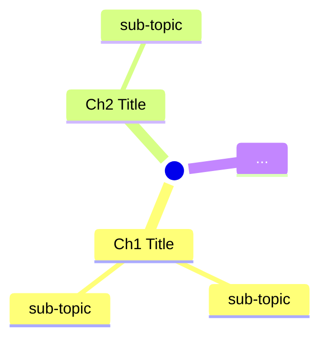
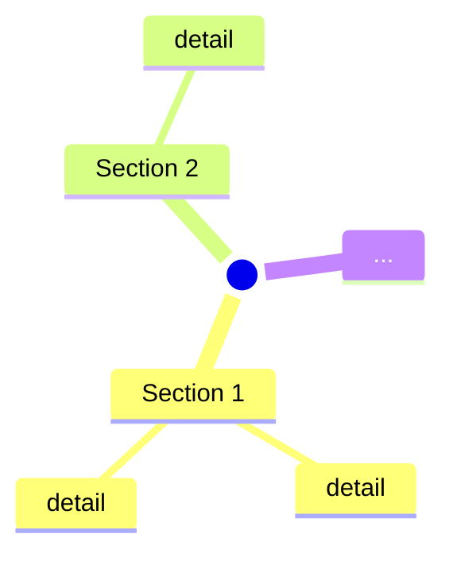
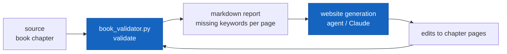

# Validation Rulebook for Python Books Learning Engine

> **Purpose**: This rulebook defines the mandatory structure, content coverage, and quality rules for the Python Books Learning Engine website (`python-books-site`). Agents must use this to validate and build pages.

---

## Architecture Overview

The website follows a **3-tier hierarchy**:

```
Category (Beginner, Advanced, etc.)
  └── Book Landing Page (1 per book)
        └── Chapter Pages (1 per chapter)
```

**Each book** gets a **landing page** (overview + chapter index).
**Each chapter** gets its **own dedicated page** following the full cognitive template.

---

## Rule 1: Book Coverage

Every `.txt` file in the source folder (`cheatsheets-private/Languages/Python/Python-next/`) must have a corresponding book folder on the website. Duplicate source files (e.g., `(1).txt`, `(2).txt`) map to a single book.

**Validation check:**
- Count unique books in source folder (ignore duplicates and `.Zone.Identifier` files).
- Every source book must have a folder under its category with an `index.md` landing page.
- Every book must be listed in `mkdocs.yml` under `nav:`.

---

## Rule 2: Chapter Identification

Extract chapters from the source book using these signals:

- Explicit markers: `Chapter N`, `Part N`, `Section N`, `Exercise N`, `Step N`, `Lesson N`
- Numbered headings, Roman numerals, or lettered sections
- Major topic breaks with distinct subject matter

**Promotion rule -- when a sub-chapter becomes its own chapter page:**

A sub-chapter should be **promoted to a full chapter page** when ANY of these apply:

| Signal | Example |
|--------|---------|
| It covers **3+ distinct sub-topics** of its own | "Linked Lists" has Singly, Doubly, Circular, Skip |
| It has **significant code / algorithms** worth separate examples | "Sorting" has Bubble, Merge, Quick, Radix |
| It spans **5+ pages** in the source text | A long tutorial section |
| It is a **named design pattern, named algorithm, or named technique** that stands alone | "Observer Pattern", "Dijkstra's Algorithm" |
| It represents a **complete project or exercise group** | "Build a Web App with Flask" (Exercises 50-52) |

**Demotion rule -- when a chapter is too thin:**

Chapters that are purely introductory, less than 1 page, or just a list of definitions should be **merged** into an adjacent chapter page rather than given their own page.

**Validation check:**
- List all chapters identified from source.
- Mark promotions and demotions with justification.
- Final chapter list = the set of pages to create.

---

## Rule 3: Folder Structure

Each book lives in a subfolder under its category:

```
docs/
  <category>/
    <book-slug>/
      index.md          ← Book Landing Page
      ch01-<slug>.md    ← Chapter 1 page
      ch02-<slug>.md    ← Chapter 2 page
      ...
```

**Naming conventions:**
- Book folder: kebab-case slug of the book title (e.g., `serious-python/`, `design-patterns-gof/`)
- Chapter files: `ch<NN>-<slug>.md` (e.g., `ch01-starting-your-project.md`, `ch04-timestamps.md`)
- Use `ch00-` for introductory/prerequisite chapters
- Promoted sub-chapters keep their parent chapter number with a letter suffix: `ch03a-singly-linked.md`, `ch03b-doubly-linked.md`

**Validation check:**
- Book folder exists under the correct category.
- `index.md` exists in the book folder.
- One `.md` file per chapter in the final chapter list.
- File names follow the naming convention.

---

## Rule 4: Book Landing Page Template

The `index.md` for each book is an **overview and navigation hub**. It does NOT contain chapter-level detail.

```markdown
# :material-brain: <Book Title>

> *Author -- One-line description of the book.*

## :material-lightbulb-on: About This Book
(2-4 sentences: what the book teaches, who it's for, why it matters)

## :material-vector-polyline: Book Map

(Mermaid mindmap showing ALL chapters as Level-1 branches, key topics as leaves)



## :material-book-open-variant: Chapters

(Grid cards linking to each chapter page -- one card per chapter)

<div class="grid cards" markdown>

- :material-numeric-1-circle: [**Ch 1: Chapter Title**](ch01-slug.md)

    Brief one-line description of what this chapter covers.

- :material-numeric-2-circle: [**Ch 2: Chapter Title**](ch02-slug.md)

    Brief one-line description.

...

</div>

## :material-check-circle: Key Takeaways
(6-10 bullet points summarizing the entire book's most important lessons)
```

**Validation check:**
- Has `About This Book`, `Book Map`, `Chapters`, and `Key Takeaways` sections.
- Mermaid mindmap includes ALL chapters.
- Grid cards link to every chapter page file.
- Every linked chapter file exists.

---

## Rule 5: Chapter Page Template

Every chapter page **must** contain all 8 sections in this exact order, using these exact Material icon headers:

```markdown
# :material-brain: <Chapter Title>

> *Book Title -- Chapter N*

## :material-lightbulb-on: Intuition
(2-4 sentences: what this chapter teaches, why it matters, the core mental model)

## :material-vector-polyline: Chapter Map



## :material-book: Key Concepts
(Admonition blocks -- minimum 4, covering the chapter's most important ideas)
(Use: !!! info for theory, !!! success for patterns/examples, !!! warning for gotchas)

## :material-code-tags: Code Examples
(Minimum 2 runnable Python code blocks with brief explanations)
(Each must have a **bold description line** above it)

## :material-alert: Pitfalls
(Minimum 2 !!! warning blocks -- common mistakes specific to this chapter's topics)

## :material-help-circle: Flashcards
(Minimum 4 ???+ question blocks with answers -- for active recall)

## :material-clipboard-check: Self Test
(Minimum 2 tabbed Q&A pairs using === "Question N" / === "Answer N")

## :material-check-circle: Summary
(Minimum 4 bullet points capturing the chapter's key takeaways)
(If the source chapter has a Summary section, copy an extract of that section into this web page Summary section)
```

**Validation check:**
- All 8 section headers present in order.
- Minimum content counts met for each section.
- Mermaid mindmap renders valid syntax.
- Admonitions use correct MkDocs syntax (`!!!` or `???+`).
- Code blocks use ```python fencing.
- Self Test uses `=== "Question N"` / `=== "Answer N"` tab syntax.
- If a source chapter includes a Summary section, the chapter page Summary section includes an extracted portion from that source summary.

---

## Rule 6: Chapter Map Completeness

The `mermaid mindmap` on each chapter page must reflect the **full contents** of that chapter:

- **Root node**: Chapter title (short form) in double parentheses `(( ))`.
- **Level 1 branches**: Every section / major topic within the chapter.
- **Level 2 leaves**: Key sub-topics, named techniques, named APIs, or named algorithms (aim for 2-4 leaves per branch).

**Validation check:**
- Root node exists and uses `(( ))` syntax.
- Number of Level 1 branches >= number of sections in the source chapter.
- Each branch has at least 1 leaf node.

---

## Rule 7: Key Concepts Depth

Each Key Concepts admonition on a chapter page must:

- Have a **descriptive title** in quotes (not just "Concept").
- Contain **2-5 sentences** explaining the concept.
- Include at least one **concrete detail** (a function name, a pattern name, a rule, a number).
- Cover the **breadth** of the chapter (not just one section).

**Validation check:**
- Minimum 4 admonition blocks per chapter page.
- Each admonition has a non-empty title string.
- Each admonition body is >= 2 sentences.
- At least 2 different admonition types used (`info`, `success`, `warning`).

---

## Rule 8: Code Examples Quality

Code examples on each chapter page must:

- Be **runnable Python** (no pseudocode, no partial snippets unless clearly marked).
- Have a **bold description line** above each code block.
- Cover **different sections** within the chapter.
- Use **modern Python 3** syntax (f-strings, type hints where appropriate).

**Validation check:**
- Minimum 2 code blocks with ```python fencing per chapter page.
- Each code block has a preceding bold description.
- Code blocks cover at least 2 different sections within the chapter.

---

## Rule 9: Pitfalls Relevance

Pitfall warnings on each chapter page must:

- Be **specific to that chapter's topics** (not generic Python advice).
- Describe the **mistake**, not just the correct approach.
- Include a **concrete example** of what goes wrong.

**Validation check:**
- Minimum 2 `!!! warning` blocks per chapter page.
- Each has a descriptive title.
- Each body mentions a specific error, wrong output, or misconception.

---

## Rule 10: Flashcards and Self Test Coverage

- **Flashcards** must cover concepts from **at least 2 different sections** within the chapter.
- **Self Test** questions must require **application** (not just recall) -- e.g., "What does this code output?" or "How would you solve X?"

**Validation check:**
- Minimum 4 flashcards (`???+ question`) per chapter page.
- Minimum 2 self-test Q&A pairs (`=== "Question N"` / `=== "Answer N"`) per chapter page.
- Self-test answers include code or multi-step reasoning.

---

## Rule 11: Navigation and Integration

- Every book landing page must be listed in `mkdocs.yml` under `nav:` in the correct category.
- Every chapter page must be listed under its book in `mkdocs.yml`.
- Every category must have an `index.md` landing page listing all books.

**Nav structure in mkdocs.yml:**
```yaml
nav:
  - Category:
    - category/index.md
    - Book Title:
      - category/book-slug/index.md
      - Ch 1 Title: category/book-slug/ch01-slug.md
      - Ch 2 Title: category/book-slug/ch02-slug.md
      ...
```

**Validation check:**
- Book landing page appears in `mkdocs.yml` nav.
- All chapter pages appear in `mkdocs.yml` nav under their book.
- Category `index.md` exists and lists the book.

---

## Rule 12: Content Sizing

**Book landing page:**
- **Target**: 80-200 lines (it's an overview, not deep content).

**Chapter page:**
- **Minimum**: 100 lines of markdown.
- **Target**: 150-300 lines of markdown.
- **Maximum**: 400 lines (split into sub-pages if exceeding).

**Validation check:**
- Landing page line count: 80-200.
- Chapter page line count: 100-400.

---

## Rule 13: Cognitive Science Alignment

Per the `website-guide.md`, every page (landing and chapter) must use:

- **Color psychology**: Blue (`info`) for theory, Green (`success`) for examples/intuition, Orange (`warning`) for pitfalls.
- **Icons**: Consistent Material icons per section (as defined in Rules 4 and 5).
- **Spatial memory**: Mermaid mindmap for visual overview.
- **Active recall**: Flashcards with collapsible answers.
- **Self-testing**: Tabbed Q&A for verification.
- **Chunking**: Each chapter is its own page -- the ultimate chunking.

**Validation check:**
- Admonitions use `info`, `success`, and `warning` types (not just one type).
- All section icons present per the template.
- Mermaid mindmap present and valid on every page.
- Flashcards use `???+` (collapsible) syntax.
- Self Test uses tabbed `===` syntax.

---

## Rule 14a: Semantic Coverage (NLP-based)

> **Why this rule exists:** Rules 1–13 are **structural**. They check that
> a page has the right number of flashcards, the right admonition mix, the
> right mindmap, etc. They cannot tell you whether the page actually
> *covers the source material*. A page can satisfy all 13 structural rules
> while completely missing the source chapter's main ideas — for example,
> a "Cybersecurity" page that talks only about authentication when the
> source chapter is mostly about IEC 62443 / secure boot / TPM.
>
> **How this rule works:** The tool
> [`site-tools/book_validator.py`](site-tools/book_validator.py)
> converts the source book into a hierarchical Tree, runs an NLP keyword
> extractor (TF-IDF + n-grams + stopwords) on each section, fuzzy-matches
> each section to a website page, and reports the **coverage ratio** —
> i.e., what fraction of the source's top-K keywords actually appear in
> the matched page. The output is a markdown report a website-generation
> agent can read and act on directly.

### How to run

```bash
PY=/home/madhavan/projects/.venv/bin/python
TOOL=/home/madhavan/projects/site-tools/book_validator.py

# Single source PDF → matched pages under one book folder
$PY $TOOL validate \
    --source path/to/extracted/text_pdftotext.txt \
    --docs   docs/category/book-slug \
    --top 12 \
    --threshold 0.5 \
    --match-threshold 0.3 \
    --out-md  /tmp/coverage.md \
    --out-json /tmp/coverage.json

# Whole folder of extracted PDFs → entire category
$PY $TOOL validate \
    --source path/to/extracted_pdfs_folder \
    --docs   docs/category \
    --top 12 \
    --threshold 0.5
```

### Exit codes

- `0` — every matched section cleared `--threshold`. **Page passes Rule 14a.**
- non-zero — at least one section is below `--threshold`. **Page fails Rule 14a.**

This makes the rule directly usable as a pre-commit hook or CI gate.

### Validation check

- **Per source chapter**, run `book_validator.py validate` against the
  corresponding chapter page (or book folder).
- **Coverage ratio** ≥ 50 % on the dominant section's top-12 keywords.
- **No "unmatched" core chapter** — every Tree node above level 2 with
  ≥ 200 chars of body must match a page above the fuzzy threshold.
- **Missing keywords list** is the **action list** for the website
  generation agent. The agent must add a paragraph or example mentioning
  each missing keyword (or justify why it isn't relevant).

### Feedback loop with the website generation agent



The loop terminates when re-running `book_validator.py validate` returns
exit code `0` (all matched sections above threshold).

### Tuning notes

- Default keyword extractor is **pure stdlib TF-IDF** — works out of the
  box. For higher-quality keywording on prose-heavy books install `yake`
  or `scikit-learn` and pass `--method yake` / `--method sklearn`.
- The `--match-threshold` (Jaccard on H1 tokens) is set to `0.30` by
  default. Raise it to `0.5` if you see false-positive page matches; lower
  it to `0.20` if real matches are being missed (e.g., because chapter
  titles have been heavily rephrased).
- The `--threshold` (coverage ratio) starts at `0.5` for new pages and
  should be raised to `0.7` once a book is mature.

---

## Rule 14b: Crispy Extract — Source-to-Page Text Quality

> **Why this rule exists:** Source PDFs contain *convulsing* prose — wordy,
> rambling sentences padded with filler. Copying them verbatim into a study
> page produces forgettable mush. Every extract on every page must be
> distilled into a **memorable, crispy** form before it ships.

The rule below applies to **every** Intuition paragraph, every Key-Concept
admonition body, every flashcard answer, every Self-Test answer, and every
Summary bullet.

### 14b.1 — Identify the core message

For each candidate paragraph, ask: *what is the one thing the reader must
remember?* If you can't answer in 12 words, the paragraph isn't a good
extract — pick a different paragraph or summarise it.

### 14b.2 — Ruthless trimming (the chain-saw method)

Strip the source paragraph in this order:

| Strip | Examples |
|---|---|
| **Filler adverbs** | `really`, `basically`, `very`, `quite`, `extremely`, `essentially`, `actually`, `simply`, `obviously`, `clearly`, `literally` |
| **Hedging stems** | `it is often considered`, `at the end of the day`, `as a matter of fact`, `for the most part`, `in many cases`, `it should be noted that`, `needless to say` |
| **Redundant pairs** | `full and complete` → `complete`; `each and every` → `every`; `null and void` → `void` |
| **Empty connectives** | `That` / `Which` / `In order to` whenever the sentence still parses without them |
| **PDF page-cruft** | filename stamps (`37-133-0-p001.qxd`), dates, times, `Page N`, all-caps book-title banners, orphan page numbers |

### 14b.3 — Make it crisp and active

- **Active voice** — *"She wrote the report"* not *"The report was written by her"*.
- **Stronger verbs** — *"assessed"* not *"gave an assessment of"*.
- **Short sentences** — break long, comma-laden sentences into two short ones.
- **Drop trailing question marks** that are part of citations (`Couldn't I just keep using that?` 62 …`).

### 14b.4 — Add memory features

- **Rule of three** — group ideas in threes when possible.
- **Concrete metaphors** — turn abstract claims into images.
- **Impact placement** — put the most important word at the **end** of the sentence.
- **Orphan sentence** — set a key insight on its own line so it stands out.

### 14b.5 — Validation checks

For every extract written to a page:

| Check | Threshold |
|---|---|
| **Length** | Intuition ≤ 4 sentences (≤ 60 words). Key-Concept body 2–4 sentences. Flashcard answer 1–3 sentences. |
| **No filler tokens** | None of the strip-list words above appear in the final extract. |
| **No PDF cruft** | No filename stamps, dates, times, `Page N`, or all-caps banner lines. |
| **No mid-sentence start** | First word is capitalised; sentence has subject + verb. |
| **Terminal punctuation** | Each extract ends with `.`, `!`, or `?`. |
| **No question fragments from source** | Don't carry forward dangling quoted questions like `Couldn't I just keep using that?` 62 …` — strip the trailing fragment or drop the sentence entirely. |

### 14b.6 — Worked example

> **Before:** *It is often considered by many people to be a very essential
> factor that at the end of the day you have to make sure you look at the
> big picture to have a better understanding.*

> **After:** *To succeed, look at the big picture.*

### Implementation

The crispy-extract rules above are enforced by `populate_chapters.py` in
[`MKwebsite/_tools/`](MKwebsite/_tools/populate_chapters.py) — see the
`crispify()` function. Re-run after any change to the rules; pages that
fail any 14b.5 check are flagged by `validate_pages.py` as **partial
conversions**.

---

## Rule 14: Exercises and Solutions Coverage

If a source book or chapter contains an **Exercises** section, that content must be represented in the corresponding web page(s):

- Include an `## :material-dumbbell: Exercises` section on the relevant chapter page(s) when exercises are chapter-specific.
- If exercises are grouped at book level, include a dedicated exercises page linked from the book landing page and `mkdocs.yml`.
- Copy the exercise prompts as extracts from source (edited only for clarity/formatting, not meaning).
- Provide a solution for each included exercise.
- Solutions must show reasoning steps, not just final answers.
- For coding exercises, include runnable `python` code where applicable.

**Validation check:**
- If source has exercises, at least one corresponding exercises section or page exists.
- Every included exercise has a matching solution.
- Solutions are technically correct and complete for the exercise prompt.
- Coding exercise solutions use fenced `python` blocks when code is required.

---

## Validation Procedure

### Validating a Book

1. **Read the source `.txt` file** -- extract full table of contents.
2. **Identify chapters** -- apply promotion/demotion rules (Rule 2).
3. **Check book folder** exists with `index.md` and all chapter files (Rule 3).
4. **Validate landing page** against Rule 4.
5. **Validate each chapter page** against Rules 5-14.
6. **Check navigation** in `mkdocs.yml` (Rule 11).
7. **Run semantic coverage check** (Rule 14a):
   `book_validator.py validate --source <txt> --docs <book-folder> --threshold 0.5`
   Feed the markdown report back to the writing agent for any sections under threshold; iterate until exit code 0.

### Report Format

```
BOOK: <title>
SOURCE: <path to .txt>
FOLDER: <path to book folder>
CHAPTERS IDENTIFIED: N
CHAPTER PAGES FOUND: N

LANDING PAGE:
  RULE 4 (Template):       PASS / FAIL -- issues: [list]
  RULE 6 (Mindmap):        PASS / FAIL -- missing branches: [list]
  RULE 12 (Size):          PASS / FAIL -- lines: N

CHAPTER: <ch01-slug.md>
  RULE 5 (Template):       PASS / FAIL -- missing sections: [list]
  RULE 6 (Chapter Map):    PASS / FAIL -- missing branches: [list]
  RULE 7 (Key Concepts):   PASS / FAIL -- count: N
  RULE 8 (Code Examples):  PASS / FAIL -- count: N
  RULE 9 (Pitfalls):       PASS / FAIL -- count: N
  RULE 10 (Flashcards):    PASS / FAIL -- flashcards: N, tests: N
  RULE 12 (Size):          PASS / FAIL -- lines: N
  RULE 13 (Cognitive):     PASS / FAIL -- issues: [list]

(repeat for each chapter)

RULE 11 (Navigation):     PASS / FAIL -- issues: [list]

OVERALL: PASS / FAIL
GAPS TO FIX: [prioritized list]
```

---

## Category Placement Rules

| Category | Criteria |
|----------|----------|
| **Beginner** | First Python book, assumes no prior programming, covers basics end-to-end |
| **Core Reference** | Comprehensive language reference, covers Python deeply, good as a desk reference |
| **Advanced** | Assumes Python knowledge, covers professional practices, optimization, architecture |
| **Design Patterns** | Focuses on OOP patterns, software architecture, or design principles |
| **Specialized** | Domain-specific: scientific computing, DevOps, embedded, computer vision, etc. |

---

## Quick Reference: Minimum Counts

| Element | Book Landing Page | Chapter Page |
|---------|-------------------|--------------|
| Intuition / About | 2-4 sentences | 2-4 sentences |
| Mindmap | Full book (all chapters) | Full chapter (all sections) |
| Key Concepts | -- | 4 admonitions |
| Code Examples | -- | 2 code blocks |
| Pitfalls | -- | 2 warnings |
| Flashcards | -- | 4 questions |
| Self Test | -- | 2 Q&A pairs |
| Summary / Takeaways | 6 bullets | 4 bullets |
| Chapter grid cards | 1 per chapter | -- |

---

## Example: Book with 8 Chapters

```
docs/advanced/serious-python/
  index.md                          ← Landing: mindmap, chapter grid, takeaways
  ch01-starting-your-project.md     ← Full cognitive template
  ch02-modules-libraries.md         ← Full cognitive template
  ch03-documentation-apis.md        ← Full cognitive template
  ch04-timestamps-timezones.md      ← Full cognitive template
  ch05-distributing-software.md     ← Full cognitive template
  ch06-unit-testing.md              ← Full cognitive template
  ch07-methods-decorators.md        ← Full cognitive template
  ch08-functional-programming.md    ← Full cognitive template
```

Each `chNN-*.md` file contains: Intuition → Chapter Map → Key Concepts → Code → Pitfalls → Flashcards → Self Test → Summary.

---

*This rulebook should be used by all agents creating or validating pages in the Python Books Learning Engine.*
