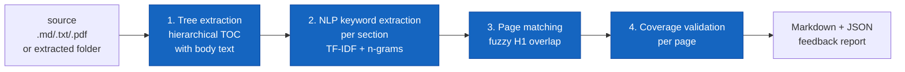

# 🧠 Cognitive Website Guide — From Corpus to Learning Engine

> *A tool-driven cookbook for building **memory-optimized study websites** from
> raw source material (PDFs, books, manuals, transcripts), using MkDocs +
> Material + a small set of Python generators living in
> `/home/madhavan/projects/site-tools/`.*

This guide is split into three layers:

| Layer | What it covers |
|---|---|
| **Part I — Theory** | The 10 cognitive principles every page must obey |
| **Part II — Toolchain** | The Python + CLI tools that turn a corpus into pages, decks, and mind maps |
| **Part III — Operations** | Granular workflow, registering sites in `start-sites.sh`, common pitfalls, sites ledger |

---

# Part I — The 10 cognitive principles

These are the *immutable* design rules. Every page in every site this guide
produces must obey them. Think of them as the **substrate**; the toolchain in
Part II is just a fast way to apply them at scale.

## 🎨 1. Color psychology

**Goal:** Use color to encode meaning → faster recognition, stronger memory.

```markdown
!!! info "Definition"        # blue   = theory
!!! success "Example"        # green  = intuition
!!! warning "Pitfall"        # orange = danger zone
!!! danger "Critical"        # red    = safety / cyber
!!! abstract "Memory anchor" # purple = mnemonic
```

**Why it works:** color triggers automatic categorization in the brain → less
cognitive load on each re-read.

## 🧩 2. Shapes (spatial layouts)

Use **grids**, **cards**, **columns**, **tabs** consistently across pages.

```markdown
<div class="grid cards" markdown>
- :material-lightbulb-on: **Concept**
- :material-code-tags: **Example**
- :material-alert: **Pitfall**
</div>
```

**Why it works:** the brain remembers shapes + positions better than text.

## 🎭 3. Icons (visual mnemonics)

Same icon for the same concept everywhere:

```
:material-brain: Concept   :material-cpu-64-bit: Performance
:material-memory: Memory   :material-bug: Pitfall
```

**Why it works:** icons act as anchors → faster recall, stronger traces.

## 🎧 4. Audio (sparingly)

```html
<audio controls>
  <source src="../audio/memory-tip.mp3" type="audio/mpeg">
</audio>
```

**Why it works:** activates separate neural circuits → multi-modal recall.

## 🧱 5. Chunking (micro-learning)

Split big topics into **micro-pages of 1–3 minutes each**:

```
topic/
  01-intuition.md
  02-definition.md
  03-diagram.md
  04-example.md
  05-pitfalls.md
  06-flashcards.md
```

**Why it works:** chunking is one of the strongest cognitive-load reducers.

## 🔁 6. Active recall (flashcards)

```markdown
???+ question "What is a pointer?"
    A pointer stores the memory address of another variable.
```

**Why it works:** retrieval practice is the **#1 scientifically-proven**
learning technique. → In Part II, [`gen_flashcards.py`](#21-genflashcardspy)
generates these in bulk from a YAML deck.

## 🧭 7. Spatial memory (mind maps)

```markdown

```

**Why it works:** spatial organization helps form mental models. → In
Part II, [`gen_mindmap.py`](#22-genmindmappy) auto-generates rich mind maps
(and clickable graphs) from the docs tree.

## 🔄 8. Spaced repetition

```
flashcards/
  level1/   ← quick recall
  level2/   ← applied
  level3/   ← synthesis
```

The YAML deck format used by `gen_flashcards.py` has a `level: 1|2|3` field
per card, and the tool can filter by level (`--level 1`).

**Why it works:** spacing strengthens long-term retention.

## 🧪 9. Self-testing

```markdown
=== "Question"
    What is the time complexity of binary search?

=== "Answer"
    O(log n)
```

**Why it works:** testing **is** learning, not just assessment.

## 📐 10. Consistency (page templates)

Every micro-page follows the same skeleton (see [§3.4 — Page template](#34-page-template-the-eight-section-skeleton)).

**Why it works:** predictable structure removes cognitive friction.

---

# Part II — The toolchain

The toolchain is a small set of Python scripts in
[/home/madhavan/projects/site-tools/](site-tools/) and CLI utilities already
installed in the shared venv. Together they let you go from a folder of PDFs
to a fully wired study site without ever copy-pasting raw text.

## §1 — Tool inventory

### 1.1 — Corpus extraction (PDF → text + images + tables)

| Tool | Best for | How to invoke |
|---|---|---|
| **`pdftotext -layout`** (poppler) | Faithful page-aligned text | `pdftotext -layout in.pdf out.txt` |
| **`pdfimages -all`** (poppler) | Raw image stream extraction | `pdfimages -all in.pdf imgdir/img` |
| **`mutool extract`** | Same, smarter naming | `mutool extract in.pdf` |
| **PyMuPDF (`fitz`)** | Page-anchored text + named per-page images | `import fitz; fitz.open(...)` |
| **`pdfplumber`** | Per-page table extraction (best precision) | `with pdfplumber.open(...) as p: p.pages[0].extract_tables()` |
| **`camelot-py`** | Tables in PDFs with visible rules | `camelot.read_pdf(pdf, flavor='lattice')` |
| **`tabula-py`** | Fallback table extractor (Java) | `tabula.read_pdf(pdf, pages='all')` |

All seven are wired up in **[`site-tools/extract_corpus.py`](site-tools/extract_corpus.py)**
behind a single CLI.

!!! tip "Why run *all* of them?"
    No single PDF extractor is reliable for all documents. Layout-heavy datasheets
    need pdfplumber+camelot; scanned books need pdfimages; flowing prose needs
    pymupdf. Running them in parallel and **cross-validating** gives you the
    highest-fidelity corpus.

### 1.2 — Searching the extracted corpus

| Tool | Use case |
|---|---|
| **`rg`** (ripgrep) | Find headings, specs, terms across all extracted text |
| **`rg --type-add 'pdftxt:text_pdftotext.txt'`** | Restrict to one extractor's output |
| **`fd`** (if installed) | Locate by filename |
| **Python `re` + `pathlib`** | Programmatic walks (`Path.rglob('text_*.txt')`) |

Example — find every line mentioning a hazardous-location standard:

```bash
rg -n -i 'IEC ?6244[3-9]|ATEX|Ex db|Class I Div' \
   /home/madhavan/projects/cheatsheets-private/Resume_info/ABB_Preparation/product-info \
   --glob 'text_*.txt'
```

### 1.3 — Generators (Python, in venv)

| Tool | Input | Output |
|---|---|---|
| **[`extract_corpus.py`](site-tools/extract_corpus.py)** | Folder of PDFs | Per-PDF subfolder: text/images/tables × N extractors + JSON summary |
| **[`gen_flashcards.py`](site-tools/gen_flashcards.py)** | YAML deck | Markdown of `??? question` blocks (filterable by level/tag/section) |
| **[`gen_mindmap.py`](site-tools/gen_mindmap.py)** | `docs/` subtree | Mermaid `mindmap` and/or clickable `graph LR` markdown |
| **[`book_validator.py`](site-tools/book_validator.py)** | Source `.md`/`.txt`/`.pdf` + website `docs/` dir | Hierarchical Tree → NLP keywords per section → coverage report (markdown + JSON) **for an LLM website-generation agent to act on** |

All four live in `/home/madhavan/projects/site-tools/` and run via the shared
venv: `/home/madhavan/projects/.venv/bin/python site-tools/<script>.py`.

---

## §2 — Pythonic generators

### 2.1 — `gen_flashcards.py`

**Source of truth = a YAML deck.** Markdown is generated, never hand-edited.

#### Deck schema

```yaml
title: "GCP100 — Master Flashcard Deck"
description: "Active-recall deck distilled from the GCP100 micro-pages."

cards:
  - q: "What product family is GCP100 in?"
    a: "The **GCPro Series** — ABB's new generation of process gas chromatographs."
    level: 1                # 1=quick recall, 2=applied, 3=synthesis
    section: identity       # any string — used for grouping
    tags: [intro]

  - q: "Decode `Ex db IIB+H2 T6 Gb`."
    a: |                    # multi-line YAML literal
      - **Ex db** — flameproof
      - **IIB+H2** — gas group including hydrogen
      - **T6** — max surface temp 85 °C
      - **Gb** — equipment protection level (Zone 1)
    level: 2
    section: safety
    tags: [hazloc, atex]
```

#### Invocations

```bash
PY=/home/madhavan/projects/.venv/bin/python
TOOL=/home/madhavan/projects/site-tools/gen_flashcards.py

# Whole deck, grouped by section
$PY $TOOL deck.yaml -o all.md --group-by section

# Just level-1 (quick recall) cards for a daily drill page
$PY $TOOL deck.yaml -o daily.md --level 1

# Just the cybersecurity tag, shuffled with a fixed seed
$PY $TOOL deck.yaml -o cyber.md --tag cyber --shuffle --seed 42

# Closed by default (force the user to click → harder retrieval)
$PY $TOOL deck.yaml -o exam.md --closed
```

#### Why YAML, not markdown?

- **Single source of truth** — the same deck powers a "by section" page, a
  "level 1 only" daily drill, and a "tag=cyber" focused review.
- **Programmatically queryable** — write a 5-line script to print
  `len(deck['cards'])` per section, or to lint for duplicate questions.
- **Diff-friendly** — adding one card is a 4-line YAML diff, not a 10-line
  markdown rewrite.
- **Round-trippable** — see the worked example in [§4](#4--worked-example-the-abb-product-hub).

### 2.2 — `gen_mindmap.py`

**Walks any docs subtree** and emits one of two Mermaid styles:

| `--emit` | Style | Best for |
|---|---|---|
| `mindmap` *(default)* | Native `mindmap` block, round nodes, no links | Quick visual overview at the top of an index page |
| `graph` | `graph LR` with **clickable nodes**, color bands per top-level branch, distinct shapes for files vs folders | Sitemap pages — readers can navigate by clicking |
| `both` | Both blocks, separated by H2 headings | A dedicated `sitemap.md` page |

#### How richness is built up

1. **Tree walk** — `walk()` recursively reads the docs subtree, sorts
   directories first, skips anything starting with `.` or `_`.
2. **Title resolution** — for each `.md` file, `extract_h1()` reads the file,
   skips YAML front matter, finds the first `# ` heading and **strips icon
   shortcodes** (`:material-foo:`) so the diagram stays clean.
3. **Folder titles** — if a folder has an `index.md`, its H1 is promoted to
   become the branch label.
4. **Click links** — in `graph` mode, every leaf gets a `click n3 "path/to/file.md" "Open page"`
   handler. Paths are computed **relative to the walked root** so the diagram
   works no matter where the output file lives within that subtree.
5. **classDef colour bands** — top-level branches cycle through a 7-colour
   palette. Each branch's children inherit the same band → spatial memory.
6. **Shape encoding** — folders get rounded `(["..."])` nodes, files get
   square `["..."]` nodes. Brain instantly knows what to click.

#### Invocations

```bash
PY=/home/madhavan/projects/.venv/bin/python
TOOL=/home/madhavan/projects/site-tools/gen_mindmap.py
DOCS=/path/to/MKwebsite/docs

# Native mindmap, drop into a sitemap page
$PY $TOOL $DOCS/Products -o $DOCS/Products/sitemap.md \
    --emit both --root "ABB Study Hub" --max-depth 4 \
    --page-title "Product Hub Sitemap"

# Inject between markers in an existing index page
$PY $TOOL $DOCS/Products -o $DOCS/Products/index.md --inject --emit graph
```

For `--inject`, the target file must contain markers:

```markdown
<!-- mindmap -->
<!-- /mindmap -->
```

The script replaces *only* what's between them. Hand-written prose around
the markers is preserved.

### 2.3 — `book_validator.py`

**Closes the agent loop.** Where `gen_*` tools *produce* content,
`book_validator.py` *checks* it against the source corpus and emits a
machine-readable feedback report a website-generation agent (Claude or
similar) can act on directly.

#### What it does (3 stages)



1. **Tree extraction** — `extract_tree(source)` walks markdown headings,
   plain-text chapter/section markers (`Chapter N`, `1.2.3 Title`,
   ALL-CAPS lines), or a folder of PDF-extracted `text_*.txt` files. TOC
   regions, dot leaders, multi-column figure labels, and page numbers
   are filtered out automatically. Result: a `Node` tree with `(title,
   level, body, children)`.
2. **NLP keyword extraction** — for every node with substantial body
   (`≥80` chars), compute the top-K phrases. The default is a pure-stdlib
   **TF-IDF over uni/bi/trigrams** with embedded English stopwords, n-gram
   collapsing (drop shorter phrases that are substrings of higher-scoring
   longer ones), and a length bonus that prefers 2–3 word phrases over
   single tokens. Optional `--method yake` and `--method sklearn` upgrades
   if the libraries are installed (graceful fallback otherwise).
3. **Page matching** — `build_page_index(docs_dir)` walks the website's
   `docs/` tree, extracts each page's H1, and `match_pages()` assigns each
   tree node to its best-fit page by **Jaccard similarity** on title
   tokens (above a configurable `--match-threshold`). One page per node;
   already-used pages aren't re-matched.
4. **Validation** — for every matched node, `validate_node()` checks which
   of its top-K source keywords actually appear (whole-word, case-insensitive)
   in the matched page's body. The result is a coverage ratio + a list of
   *hits* and *misses*.

#### Output: feedback for an agent

The markdown report is structured for an LLM to read and act on:

```markdown
## § 2.1 GCPro technical specifications

!!! success "Coverage: 50 % (5/10)"
    Matched page: `02-specifications.md`

**Missing keywords (add to the page):**

- `iib+h2`
- `pressure psig`
- `ambient`
- `bit`
- `maximum`

<details><summary>Matched (5)</summary>
- modbus
- carrier gas
- ...
</details>
```

A coding agent can take that block and produce a one-shot edit:
*"Add a paragraph to `02-specifications.md` mentioning the IIB+H₂ gas
group, the pressure range in psig, and ambient temperature limits."*

The JSON report (`--out-json`) carries the same data structurally for
programmatic pipelines.

#### Invocations

```bash
PY=/home/madhavan/projects/.venv/bin/python
TOOL=/home/madhavan/projects/site-tools/book_validator.py

# 1. Just print the TOC tree of a source
$PY $TOOL tree path/to/book.md
$PY $TOOL tree path/to/extracted/text_pdftotext.txt
$PY $TOOL tree path/to/extracted_pdfs_folder/   # walks all text_*.txt

# 2. Extract keywords per section (no page matching yet)
$PY $TOOL keywords source.md --top 10
$PY $TOOL keywords source.md -o keywords.json

# 3. Full validate pipeline → console + markdown + JSON
$PY $TOOL validate \
    --source path/to/text_pdftotext.txt \
    --docs   path/to/MKwebsite/docs/Section \
    --top 12 \
    --threshold 0.5 \
    --match-threshold 0.30 \
    --out-md feedback.md \
    --out-json feedback.json

# Exit code 0 = all matched sections passed threshold; non-zero = failures
```

#### Console output

```
==============================================================================
VALIDATION FEEDBACK
==============================================================================

✗ [██░░░░░░░░░░░░░░░░░░]  10%  1 Safety, security, and compliance
          page : 05-safety.md
          MISS : property damage, safety requirements, gcpro safety cyber...

✓ [██████████░░░░░░░░░░]  50%  2.1 GCPro technical specifications
          page : 02-specifications.md
          MISS : iib+h2, bit, maximum, ambient, pressure psig

------------------------------------------------------------------------------
  matched=5  pass=1  fail=4  unmatched=113
------------------------------------------------------------------------------
```

#### Why a tree, not a flat TOC?

The earlier validator
([`validate_and_populate_websites.py`](validate_and_populate_websites.py))
extracts a *flat list* of headings from the "Contents" page and grep-searches
for them in the markdown. That fails on:

- **Paraphrased headings** — the website page H1 is rephrased; literal grep misses.
- **Chunked content** — one source chapter → 4 micro-pages; the validator can't tell which chunk should hold what.
- **Semantic coverage** — having the chapter title in the page tells you nothing about whether the page actually *covers the topic*.

`book_validator.py` fixes all three:

- **Tree** preserves hierarchy → you can validate at chapter or section level.
- **NLP keywords** validate *content*, not literal headings.
- **Per-section coverage** gives the agent line-item feedback ("add these 5 phrases to this page").

#### Pure-stdlib by design (with optional upgrades)

The default `--method stdlib` uses **only Python stdlib + a 200-word
embedded stopword list**. No models to download, no `pip install`. For
better keywording on prose-heavy books:

```bash
pip install yake             # add `--method yake`
pip install scikit-learn     # add `--method sklearn`
```

Both fall back to stdlib if not installed, so the script never breaks.

---

### 2.4 — `extract_corpus.py`

**One CLI to run all seven extractors** over a folder of PDFs.

```bash
PY=/home/madhavan/projects/.venv/bin/python
TOOL=/home/madhavan/projects/site-tools/extract_corpus.py

# Extract everything from a folder
$PY $TOOL --input /path/to/pdfs --output /path/to/extracted

# Single PDF
$PY $TOOL --input one.pdf --output /tmp/one_out

# Skip the slow Java/CV extractors during iteration
$PY $TOOL --input pdfs/ --output out/ --skip camelot,tabula
```

Output layout per PDF:

```
extracted/<pdf-stem>/
├── text_pdftotext.txt
├── text_pymupdf.txt
├── images_pdfimages/
├── images_pymupdf/
├── tables_pdfplumber/
├── tables_camelot/
└── tables_tabula/
extracted/extraction_summary.json   ← JSON report of what worked
```

The summary JSON is the **starting point of the inventory phase** — `jq` (or
just Python) tells you which PDFs failed which extractors, how many tables
each yielded, etc.

> The project-specific original is at
> `cheatsheets-private/Resume_info/ABB_Preparation/product-info/extract_pdf_assets.py`
> — that one has hard-coded paths but is otherwise the reference implementation.
> `site-tools/extract_corpus.py` is the generic version.

---

## §3 — The granular pipeline (Corpus → Cognitive site)

Every site this guide produces follows the same **5-phase / 21-step pipeline**.
Phases are gated: don't move on until the gate is green.


### 3.1 — Phase A · INGEST (raw input → searchable corpus)

Goal: every byte of source material is on disk in 3+ formats so you can
cross-validate.

| Step | Action | Tool | Gate |
|---|---|---|---|
| **A1** | Identify the corpus — list every PDF / book / transcript | `find / fd / rg --files` | A folder you can `ls` |
| **A2** | Sanity-check filenames (no spaces, no Zone.Identifier) | `rename` / `mv` | All names match `[A-Za-z0-9._-]+` |
| **A3** | Run all 7 extractors over the corpus | `extract_corpus.py` | `extraction_summary.json` exists, all `ok: true` |
| **A4** | Spot-check one text file vs the original PDF | `head -100 text_pdftotext.txt` | Headings, tables, prose all present |
| **A5** | Spot-check one image folder | `ls images_pymupdf/` | Page-anchored filenames present |

**Gate A → B:** `extraction_summary.json` exists and `jq '.results[].tools | to_entries[] | select(.value.ok == false)' summary.json` returns nothing important.

### 3.2 — Phase B · INVENTORY (corpus → topic map)

Goal: a single document that lists *what's in the corpus* and how to slice it.

| Step | Action | Tool | Output |
|---|---|---|---|
| **B1** | List all heading-like lines per PDF | `rg -n '^[A-Z][A-Z0-9 ./]{6,}$' text_pdftotext.txt` | Headings printout |
| **B2** | Cluster by product / topic | manual / `sort \| uniq -c` | Topic list |
| **B3** | Decide on **folder taxonomy** — one folder per product/topic | text editor | `taxonomy.md` (working file) |
| **B4** | For each folder, list source documents that feed it | text editor | Doc → folder map |
| **B5** | Run an LLM/Claude pass — *summarize each PDF in 5 bullets and 6 specs* | Claude (Explore agent) | Per-PDF summary report |

**Gate B → C:** taxonomy.md exists, every PDF is mapped to exactly one folder, and you can recite the top 3 specs of each product from memory.

### 3.3 — Phase C · STRUCTURE (topic map → empty page skeleton)

Goal: every micro-page exists as an empty file with a title and a `.pages`
nav entry. **No content yet** — just bones.

| Step | Action | Tool |
|---|---|---|
| **C1** | Create the site dir | `mkdir -p path/to/MKwebsite/{docs,_assets}` |
| **C2** | Drop in `mkdocs.yml` (canonical config — see §5.2) | copy from a known-good site |
| **C3** | Per topic, create the 8-section skeleton (see §3.4) | `for s in 01-overview 02-spec ...; do touch $s.md; done` |
| **C4** | Write each subfolder's `.pages` listing the micro-pages in order | text editor |
| **C5** | Symlink images: `_assets/<topic>/ → /path/to/extracted/<pdf>/images_pymupdf/` | `ln -sfn` |
| **C6** | Run `mkdocs build` — should succeed with empty pages | venv |

**Gate C → D:** site builds, you can navigate to every empty page via the nav.

### 3.4 — Phase C.5 — Page template (the eight-section skeleton)

Every micro-page follows this template. **Do not deviate** — predictability is
the whole point.

```markdown
---
title: "Page Title"
sources:                  # NEW — multi-book attribution (see §7.1)
  canonical: "<book> — <chapter/section>"
  corroborating: "<other book> — <chapter>"
  code:
    - _assets/src/<file>.c
---

# :material-icon: Page Title

> One-sentence positioning of why this page exists.

## :material-lightbulb-on: Intuition
> Plain-language framing — what would I tell a friend?

## :material-book: Definition
!!! info
    The formal definition.

## :material-vector-polyline: Diagram


## :material-image: Visuals
{ width="380" }

## :material-table: Specs / Reference
| Param | Value |
|---|---|

## :material-alert: Pitfalls
!!! warning
    Common confusions, gotchas, hazards.

## :material-help-circle: Flashcards
???+ question "..."
    ...

## :material-clipboard-check: Self-test
=== "Question"
=== "Answer"

## :material-check-circle: Summary
- Key idea 1
- Key idea 2

[← prev](prev.md) · [Next → next](next.md){ .md-button .md-button--primary }
```

### 3.5 — Phase D · WRITE (skeleton → narrative pages)

Goal: every micro-page has prose, diagrams, and embedded extracts from the
corpus.

| Step | Action | Tool | Notes |
|---|---|---|---|
| **D1** | For each page, **read the relevant extracted text** before writing | `rg`, `Read` | Don't paraphrase what you haven't read |
| **D2** | Draft the **Intuition** + **Definition** sections in your own words | text editor | First sentence is the highest-value sentence |
| **D3** | Embed source images via the `_assets/` symlink | `` | Verify the path resolves |
| **D4** | Add specs tables — copy from `tables_pdfplumber/*.csv` | text editor | One spec table per page |
| **D5** | Add a Mermaid diagram — flow, state, mind-map fragment | text editor | One diagram minimum per page |
| **D6** | Add 2–3 inline pitfalls in `!!! warning` blocks | text editor | These are the things you'd tell a junior |
| **D7** | Add a 5-bullet **Summary** | text editor | Stand-alone — readable without the rest |

**Gate D → E:** every page in `mkdocs serve` reads top-to-bottom without
gaps. No "TBD", no placeholder text, every image renders.

### 3.6 — Phase E · ENRICH (pages → cognitive layer)

Goal: flashcards, mind maps, self-tests — everything that turns a static
read-only page into an active learning tool.

| Step | Action | Tool |
|---|---|---|
| **E1** | Per topic, create `_decks/<topic>.yaml` with all flashcards | text editor |
| **E2** | Generate the section-grouped deck page | `gen_flashcards.py … --group-by section` |
| **E3** | Generate level-1 + level-2 + level-3 split decks (optional) | `gen_flashcards.py … --level 1` |
| **E4** | Generate the site-wide sitemap mindmap | `gen_mindmap.py … --emit both --page-title "Sitemap"` |
| **E5** | Inject smaller mind-map fragments into per-topic index pages | `gen_mindmap.py … --inject` |
| **E6** | Per page, add 2–3 self-test tabs (`=== "Q" / "A"`) | text editor |
| **E7** | Add at least one `!!! abstract "Memory anchor"` per topic | text editor |

**Gate E → F:** every page has flashcards; every topic folder has a mind map.

### 3.7 — Phase F · VALIDATE & SHIP (cognitive site → live)

| Step | Action | Tool | Gate |
|---|---|---|---|
| **F1** | `mkdocs build` from venv | `…/.venv/bin/mkdocs build` | Zero unexpected warnings |
| **F2** | Visual review at `localhost:<port>` | `start-sites.sh start <tag>` | Spot-check 1 page per topic |
| **F3** | **Semantic coverage check** — run `book_validator.py validate` per source PDF against its matched docs subfolder | `book_validator.py` | Per-section coverage ≥ 50 % on the dominant topics |
| **F4** | Feed the markdown feedback report back to the writing agent (or self) and patch missing keywords | LLM agent / text editor | F3 re-run shows ≥ 70 % coverage |
| **F5** | Run a flashcard self-drill on the largest deck | brain | Score ≥ 70 % first pass |
| **F6** | Register in `start-sites.sh` (see §5) | text editor | `start-sites.sh list` shows it |
| **F7** | Update the **sites ledger** at the bottom of this guide | text editor | New row appended |

#### F3 in practice — the validation loop

```bash
PY=/home/madhavan/projects/.venv/bin/python
TOOL=$PROJ/site-tools/book_validator.py

# 1. Run validate against the pages most likely to cover this PDF
$PY $TOOL validate \
    --source $PDFS/2108446MNAB/text_pdftotext.txt \
    --docs   $DOCS/GCP100_Gas_Chromatograph \
    --top 12 \
    --threshold 0.5 \
    --out-md  /tmp/feedback.md \
    --out-json /tmp/feedback.json

# 2. Open /tmp/feedback.md — each "##" heading is one source section,
#    each "Missing keywords" list is an actionable patch list.

# 3. Hand the markdown report to the writing agent:
#    "Patch every page in the report so that all listed missing
#     keywords appear at least once. Do not delete existing content."

# 4. Re-run validate. If coverage improved across the board, ship.
```

The exit code is **0** when all matched sections clear `--threshold`, and
**non-zero** otherwise — so this can plug straight into a CI hook or a
pre-commit check.

---

# Part III — Operations

## §4 — Worked example: the ABB Product Hub

This is the actual command sequence that produced the
**[abb-products](#-sites-built-with-this-guide) site (port 3037)** from 13 ABB
PDFs. Use it as a copy-paste template.

```bash
# ── Variables ──────────────────────────────────────────────────────────
PY=/home/madhavan/projects/.venv/bin/python
PROJ=/home/madhavan/projects
SITE=cheatsheets-private/Resume_info/ABB_Preparation
PDFS=$PROJ/$SITE/product-info        # input PDFs (already extracted)
DOCS=$PROJ/$SITE/MKwebsite/docs/Products

# ── Phase A · INGEST ────────────────────────────────────────────────────
# Already done by extract_pdf_assets.py — could be re-run with:
#   $PY $PROJ/site-tools/extract_corpus.py --input $PDFS --output $PDFS

# ── Phase B · INVENTORY ────────────────────────────────────────────────
# Headings across all extracted text
rg -n '^[A-Z][A-Z0-9 .]{6,}$' $PDFS/*/text_pdftotext.txt | head -100

# Per-PDF summary via Claude (Explore agent in this conversation)
# → produced the inventory report I worked from

# ── Phase C · STRUCTURE ────────────────────────────────────────────────
mkdir -p $DOCS/{GCP100_Gas_Chromatograph,Totalflow_6713,CCUS_Solutions,_assets}

# Symlink image assets (one per source PDF)
ln -sfn $PDFS/2108446MNAB/images_pymupdf       $DOCS/_assets/install_commission
ln -sfn $PDFS/2108447MNAB/images_pymupdf       $DOCS/_assets/operating_instructions
ln -sfn $PDFS/2108449DSAB/images_pymupdf       $DOCS/_assets/datasheet
# … (one per source PDF)

# Create empty micro-pages and .pages files
cd $DOCS/GCP100_Gas_Chromatograph
for n in 01-overview 02-specifications 03-features 04-user-interfaces \
         05-safety 06-cybersecurity 07-installation 08-operation \
         09-ccus-application 10-training 11-flashcards; do
  printf -- "---\ntitle: \"%s\"\n---\n\n# %s\n" "$n" "$n" > $n.md
done

# ── Phase D · WRITE ────────────────────────────────────────────────────
# Hand-write each micro-page following the 8-section template
# (or have Claude draft them from the corpus inventory)

# ── Phase E · ENRICH ───────────────────────────────────────────────────
# Flashcards: source-of-truth YAML deck
$PY $PROJ/site-tools/gen_flashcards.py \
    $DOCS/_decks/gcp100.yaml \
    -o $DOCS/GCP100_Gas_Chromatograph/12-deck-generated.md \
    --group-by section

# Sitemap: rich Mermaid mindmap + clickable graph
$PY $PROJ/site-tools/gen_mindmap.py \
    $DOCS \
    -o $DOCS/sitemap.md \
    --emit both --root "ABB Study Hub" --max-depth 4 \
    --page-title "Product Hub Sitemap"

# ── Phase F · VALIDATE & SHIP ──────────────────────────────────────────
cd $PROJ/$SITE/product-info/MKwebsite
$PY -m mkdocs build              # must succeed clean
$PROJ/start-sites.sh start abb-products
xdg-open http://localhost:3037
```

The actual deck for this site lives at
[`docs/Products/_decks/gcp100.yaml`](cheatsheets-private/Resume_info/ABB_Preparation/MKwebsite/docs/Products/_decks/gcp100.yaml)
and the regenerated page lives at [`12-deck-generated.md`](cheatsheets-private/Resume_info/ABB_Preparation/MKwebsite/docs/Products/GCP100_Gas_Chromatograph/12-deck-generated.md).
The auto-generated sitemap is at
[`sitemap.md`](cheatsheets-private/Resume_info/ABB_Preparation/MKwebsite/docs/Products/sitemap.md).

---

## §5 — Adding a new site to `start-sites.sh`

This section is the **muscle-memory recipe** for spinning up a new site
in this monorepo. Every new site MUST follow these rules:

1. **Use the shared venv** at `/home/madhavan/projects/.venv` — never `pip install`
   into a local one. The venv already has `mkdocs`, `mkdocs-material`,
   `mkdocs-awesome-pages-plugin`, all `pymdownx` extensions, `pyyaml`, `pymupdf`,
   `pdfplumber`, `camelot-py[cv]`, and `tabula-py`.
2. **Be registered in `/home/madhavan/projects/start-sites.sh`** so it can be
   started/stopped via the launcher.
3. **Pick a free port** from the same range as existing entries
   (`grep -oE '\|[0-9]{4}\|' start-sites.sh | sort -u`).
4. **Build clean** with `mkdocs build` before commit — no warnings beyond the
   harmless `Material for MkDocs 2.0` and `TitleInRootHasNoEffect` notices.

### 5.1 — Step 1: create the project

```bash
mkdir -p path/to/new-site/MKwebsite/docs
cd       path/to/new-site/MKwebsite
```

If the site re-uses content that already lives in another `MKwebsite/docs`
subfolder, **symlink the docs dir** instead of duplicating:

```bash
ln -sfn ../../OtherSite/MKwebsite/docs/Subsection docs
```

This is exactly how the **abb-products** site lives in two places at once
(`product-info/MKwebsite/docs` is a symlink to `…/MKwebsite/docs/Products`).

### 5.2 — Step 2: drop in `mkdocs.yml`

Use the canonical config (Material theme + awesome-pages + every pymdownx
extension already enabled). A complete known-good config lives at:
`cheatsheets-private/Resume_info/ABB_Preparation/product-info/MKwebsite/mkdocs.yml`.

### 5.3 — Step 3: register in `start-sites.sh`

Add **one line** to the `SITES=( … )` array, matching the existing format:

```
"TAG|PORT|TYPE|RELATIVE_PATH|LABEL|COLOR"
```

| Field | Example | Notes |
|---|---|---|
| `TAG` | `abb-products` | Short slug — used as `start-sites.sh start <tag>` |
| `PORT` | `3037` | Free port (mkdocs sites use 30xx) |
| `TYPE` | `mkdocs` | **Always `mkdocs`** for hand-curated sites — runs `$PROJECTS_DIR/.venv/bin/mkdocs serve` |
| `RELATIVE_PATH` | `cheatsheets-private/.../MKwebsite` | Relative to `/home/madhavan/projects` |
| `LABEL` | `🧪 ABB Product Study Hub` | Emoji + human label |
| `COLOR` | `${G}` | Reuse one of the colour vars (R/G/Y/B/M/C) |

For sites that need a **build step** before serve (e.g. a `build_mkdocs.py`
generator that emits markdown), use `python-mkdocs` instead of `mkdocs`. The
launcher will run `build_mkdocs.py` first if the file exists, then start
`mkdocs serve` from the venv. **Only use this when you actually have a
generator script** — hand-curated sites should always use plain `mkdocs`.

The launcher resolves the binary as:

```bash
"$PROJECTS_DIR/.venv/bin/mkdocs" serve --dev-addr "0.0.0.0:$port"
```

So just by choosing `mkdocs` (or `python-mkdocs`) as the type you
**automatically** get the shared venv — no extra wiring needed.

### 5.4 — Step 4: content rules

Follow Part I (the 10 cognitive principles). Use the page template in §3.4.
Generate flashcards with `gen_flashcards.py`. Generate mind maps with
`gen_mindmap.py`. Don't hand-write either of those.

### 5.5 — Step 5: verify

```bash
cd path/to/new-site/MKwebsite
/home/madhavan/projects/.venv/bin/mkdocs build       # must succeed clean
/home/madhavan/projects/start-sites.sh start <tag>   # smoke-test
xdg-open http://localhost:<port>
```

### 5.6 — Common pitfalls

- **`TitleInRootHasNoEffect` warning** from awesome-pages — harmless. It only
  fires when the docs root `.pages` has a `title:` line. Either ignore it or
  drop the title (only safe if the same `.pages` isn't reused as a subsection
  in another site).
- **`Doc file ... contains a link ..., but the target ... is not found`** —
  always real. Usually a typo in an image filename. Fix before committing.
- **Symlinked image folders** — point them at the *absolute* extracted path,
  not a relative one. mkdocs copies through symlinks during `build`.
- **`build_mkdocs.py` wiping hand-curated sections** — if a site has a
  generator, make the generator preserve hand-curated subfolders. Pattern in
  `cheatsheets-private/Resume_info/ABB_Preparation/MKwebsite/build_mkdocs.py`
  uses a `hand_curated = ["Products"]` allow-list inside `write_top_pages()`.
- **YAML deck failing to parse** — Indented code blocks inside the answer body
  need a `|` literal block. Always `level: 1` (not `level: "1"`).
- **Mermaid `mindmap` block silently empty** — Material for MkDocs needs the
  `pymdownx.superfences` custom_fences entry for `mermaid`. Check `mkdocs.yml`.
- **Click handlers not firing in `graph` mode** — Material's instant-loading
  feature can swallow clicks. Test with `navigation.instant` disabled if links
  feel dead.

---

## 📒 SITES BUILT WITH THIS GUIDE

Running record so future-you knows what's already in `start-sites.sh`. Add a
new row whenever you ship.

| Tag | Port | Path | Built from | Purpose |
|---|---|---|---|---|
| `abb-mk` | 8007 | `cheatsheets-private/Resume_info/ABB_Preparation/MKwebsite` | `build_mkdocs.py` chunker + hand-curated `Products/` | Full ABB Embedded Product Development Lead interview prep |
| `abb-products` | 3037 | `cheatsheets-private/Resume_info/ABB_Preparation/product-info/MKwebsite` | Hand-curated, symlinks `docs/` to `…/MKwebsite/docs/Products`. Flashcards regenerated from `_decks/gcp100.yaml`, sitemap regenerated by `gen_mindmap.py` | Standalone study hub for **GCP100** Gas Chromatograph, **Totalflow 6713** Flow Computer, and the **CCUS** analyzer suite — built from 13 ABB product PDFs (extracted text + images + tables) |

---

## 🛠️ Toolchain at a glance

| Tool | Path | Reads | Writes |
|---|---|---|---|
| `extract_corpus.py`  | `site-tools/extract_corpus.py`  | folder of PDFs | `text_*.txt`, `images_*/`, `tables_*/`, `extraction_summary.json` |
| `gen_flashcards.py`  | `site-tools/gen_flashcards.py`  | YAML deck | `??? question` markdown (filterable) |
| `gen_mindmap.py`     | `site-tools/gen_mindmap.py`     | `docs/` subtree | Mermaid `mindmap` and/or clickable `graph LR` |
| `book_validator.py`  | `site-tools/book_validator.py`  | source PDF/MD/text + `docs/` dir | hierarchical Tree → NLP keywords → coverage feedback (markdown + JSON) |
| `start-sites.sh`     | `start-sites.sh`                | site definitions array | per-site `mkdocs serve` background processes |

All Python tools run via `/home/madhavan/projects/.venv/bin/python`.

---

## §7 — Extensions learned from real builds

These subsections record patterns that came up while building real sites and
that weren't anticipated in the §3 pipeline. Treat them as **additions**
to the immutable recipe, not deviations.

### 7.1 — Multi-book corpora (4-book `posix-threads` site)

When two or more books cover the same topic, pick **one canonical source**
(the book whose TOC drives your site's folder taxonomy) and mark the others
as **corroborating**. Without this rule, pages drift: half the mutex page
uses Butenhof's vocabulary ("predicate," "invariant"), half uses Buttlar's
("lock object," "guard"), and the reader's mental model fragments.

**Convention — `sources:` in every page's front matter:**

```yaml
---
title: "Mutexes"
sources:
  canonical: "Butenhof, Programming with POSIX Threads — Ch. 3.2"
  corroborating: "Buttlar/Farrell/Nichols, Pthreads Programming — Ch. 3"
  code:
    - _assets/src/mutex_static.c
    - _assets/src/alarm_mutex.c
---
```

**Why a YAML list, not prose:**

- `grep -l "Butenhof" docs/**/*.md` answers "which pages use Butenhof?"
- `book_validator.py` can read `sources.canonical` to pick the right PDF to
  validate against — no more guessing which source goes with which page.
- When a book is revised, `sed -i 's|1997|1998|' docs/**/*.md` is trivial.

**Taxonomy rule:** the **canonical** book's TOC becomes the site's folder
structure. Corroborating books slot their content into the existing folders
(don't invent a new folder because Buttlar has a chapter on "Scheduling" that
Butenhof puts inside "Advanced threaded programming").

### 7.2 — Source-code-as-corpus (the Butenhof 52 `.c` examples)

Some books ship their examples as **a folder of compilable code**, separate
from the PDF. Treat that folder as a first-class part of the corpus:

```bash
# Symlink the code tree into docs/_assets/src/
ln -sfn /path/to/book-code docs/_assets/src
```

Then:

1. **Each `.c` file is a micro-page anchor.** In the page's frontmatter list
   it under `sources.code:`, and link to it from the narrative:
   `[alarm_mutex.c](../_assets/src/alarm_mutex.c)`.
2. **Embed line-referenced snippets**, not the whole file. Use fenced blocks
   with `title="alarm_mutex.c — lines 133–172"` so the reader knows where to
   look in the real file.
3. **"Run this" blocks** — give the exact `make target && ./target` command
   so the reader can reproduce the concept in one keystroke.

MkDocs copies everything under `docs/` (following symlinks) into `site/` at
build time. The source tree ends up **published alongside** the learning site
— readers can download and compile without leaving the browser.

### 7.3 — `next_port.sh` helper

Ports 3001–3040 are one scan away but the scan is annoying. Quick helper:

```bash
# site-tools/next_port.sh
#!/usr/bin/env bash
grep -oE '"[a-z0-9-]+\|([0-9]{4})' "$HOME/projects/start-sites.sh" \
  | grep -oE '[0-9]{4}' | sort -n | awk '
    BEGIN { prev = 3000 }
    { if ($1 - prev > 1) { print prev + 1; exit }
      prev = $1 }
    END { print prev + 1 }'
```

Prints the lowest free port ≥ 3001. Add to §5.3 step 3 so port choice is
one keystroke.

### 7.4 — Source-code-page pattern (deep-narrow)

When a page describes a specific source file (`alarm_mutex.c`, `backoff.c`),
follow this skeleton in addition to the 8-section template:

1. **One-line purpose** at the top.
2. **Embedded snippet** (not the full file) with annotation callouts `(1)`
   / `(2)` / `(3)` pointing at the 2–3 lines that embody the concept.
3. **State-machine or sequence diagram** showing how the snippet behaves at
   run time.
4. **"Run this" block** — the exact invocation that demonstrates the concept
   *and* a description of what the reader should observe.
5. **Anti-pattern block** — what the code *would* look like done naively,
   and why the canonical form is better.

This is the pattern used on the [mutex pages](cheatsheets-private/RefManagement/pthreads/MKwebsite/docs/02-mutexes/).

### 7.5 — `book_validator.py` with multi-book corpora

With `sources.canonical` in frontmatter, `book_validator.py` can now be run
**once per canonical book** per topic folder:

```bash
# Validate mutexes against Butenhof (the canonical source for that topic)
$PY $TOOL validate \
    --source "path/to/Butenhof.txt" \
    --docs   docs/02-mutexes \
    --top 10 --threshold 0.4 --match-threshold 0.25 \
    --out-md /tmp/mutex_feedback.md
```

**Lesson learned:** when H1s are paraphrased (which is common — "Lock &
unlock" vs Butenhof's "§3.2.2 Locking and unlocking a mutex"), the Jaccard
matcher may match the wrong page. Inspect unmatched sections and either
(a) rename the page H1 closer to the book's, or (b) lower
`--match-threshold` to 0.2. Don't fight the matcher — it's a signal that
your taxonomy has drifted from the canonical source.

---

*Last updated: see `git log -1 website-guide.md` for the timestamp. The recipe
in §3 is **immutable** — if you find yourself deviating, write a new tool
instead of skipping a step. §7 extensions are **additive** — new patterns
go here as they emerge from real builds.*
